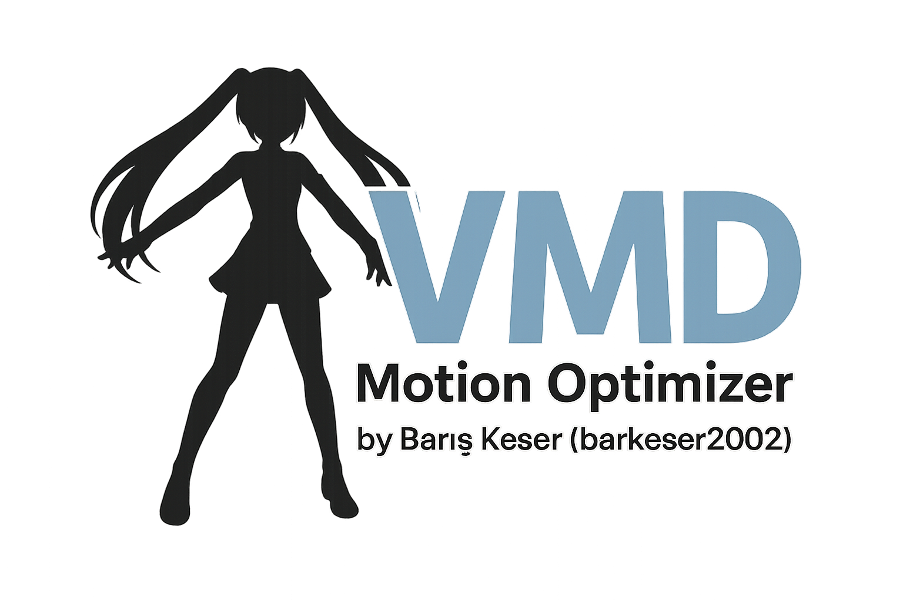

# VMD Motion Optimizer by Barış Keser (barkeser2002)



VMD Motion Optimizer is a tool to optimize MikuMikuDance (MMD) `.vmd` motion files using smart heuristics.
It reduces position/rotation keys, removes depth alignment, and applies ground stabilization.

- Author: Barış Keser (barkeser2002)
- License: GNU General Public License v3.0 (GPL-3.0) — see `LICENSE`
- Version: see `version.txt`

Features
- RDP-like curve simplification for position
- Quaternion SLERP-based angular-error simplification for rotation
- Morph key reduction
- Depth (Z) alignment removal: measure from root, apply global translation to all bones
- Ground (Y) stabilization: global translation based on per-frame min Y (feet/all bones selectable)
- PyQt6 GUI with profiles
- Portable builds via PyInstaller (Windows)

Install (CLI)
1) Python 3.11/3.12 recommended
2) Virtualenv + deps:
   - `py -3 -m venv .venv`
   - `.venv\\Scripts\\pip.exe install -r requirements.txt`

CLI Usage
```
python scripts/optimize_vmd.py input.vmd -o output.vmd \
  --pos-eps 0.05 --rot-eps-deg 0.5 --morph-eps 0.001 \
  --remove-depth --depth-smooth 3 --depth-scale 1.0 \
  --stabilize-ground --ground-target-y 0.0 --ground-smooth 5 --ground-scale 1.0 \
  --ground-all-bones
```

GUI
```
python scripts/app.py
```

Build
- CMD: `build_exe.bat` (portable folder at `dist/VMDOptimizer`)
- PowerShell: `build_exe.ps1`

Notes
- Some VMD headers may be non-standard/corrupted; the reader attempts auto-fix.
- Camera/light blocks are currently not preserved (written as 0).
- If model name is “XR Animator”, it’s replaced with “Barış Keser” by default (configurable via CLI).

Credits
- VMD Motion Optimizer by Barış Keser (barkeser2002)
- GPL-3.0 — see `LICENSE`
