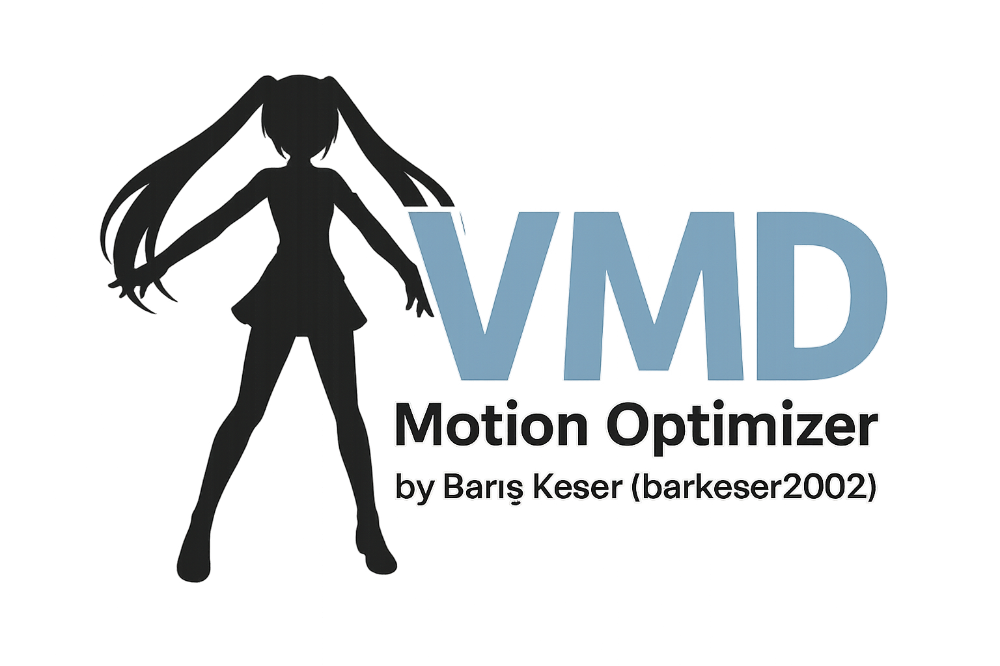

# VMD Motion Optimizer by Barış Keser (barkeser2002)



VMD Motion Optimizer, MikuMikuDance (MMD) `.vmd` motion dosyalarını akıllı sezgilerle (heuristic) optimize eder.
Pozisyon/rotasyon anahtarlarını azaltır, derinlik hizasını kaldırır ve zemin stabilizasyonu uygular.

- Yazar: Barış Keser (barkeser2002)
- Lisans: GNU General Public License v3.0 (GPL-3.0) — bkz. `LICENSE`
- Sürüm: bkz. `version.txt`

Özellikler
- RDP benzeri eğri sadeleştirme (pozisyon)
- Quaternion SLERP açısal hata sınırlı sadeleştirme (rotasyon)
- Morph anahtar sadeleştirme
- Depth (Z) hizasını kaldırma: kökten ölç, tüm kemiklere global çeviri uygula
- Ground (Y) stabilizasyon: minY’ye göre global çeviri (ayak/tüm kemikler seçilebilir)
- PyQt6 GUI, profil desteği
- PyInstaller ile portable derleme (Windows)

Kurulum (CLI)
1) Python 3.11/3.12 önerilir
2) Sanal ortam ve bağımlılıklar:
   - `py -3 -m venv .venv`
   - `.venv\\Scripts\\pip.exe install -r requirements.txt`

CLI Kullanımı
```
python scripts/optimize_vmd.py input.vmd -o output.vmd \
  --pos-eps 0.05 --rot-eps-deg 0.5 --morph-eps 0.001 \
  --remove-depth --depth-smooth 3 --depth-scale 1.0 \
  --stabilize-ground --ground-target-y 0.0 --ground-smooth 5 --ground-scale 1.0 \
  --ground-all-bones
```

GUI Kullanımı
```
python scripts/app.py
```

Derleme
- CMD: `build_exe.bat` (portable klasör `dist/VMDOptimizer`)
- PowerShell: `build_exe.ps1`

Notlar
- Bazı VMD’lerde başlık farklı/bozuk olabilir; okuyucu otomatik onarıma çalışır.
- Kamera/ışık blokları şimdilik yazılmıyor (0).
- Model adı “XR Animator” ise varsayılan olarak “Barış Keser” ile değiştirilir (CLI ile değiştirilebilir).

Kredi
- VMD Motion Optimizer by Barış Keser (barkeser2002)
- GPL-3.0 — bkz. `LICENSE`
